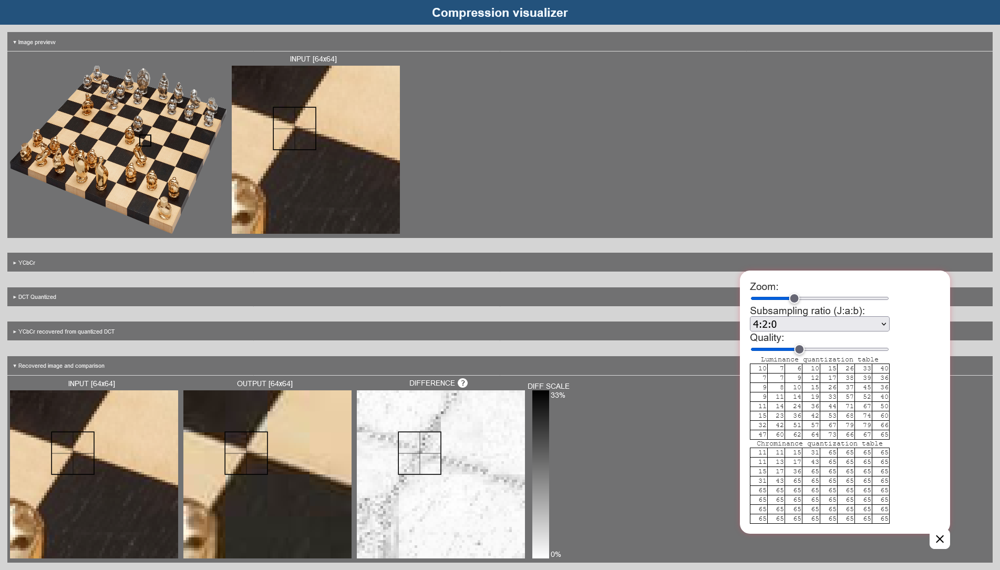
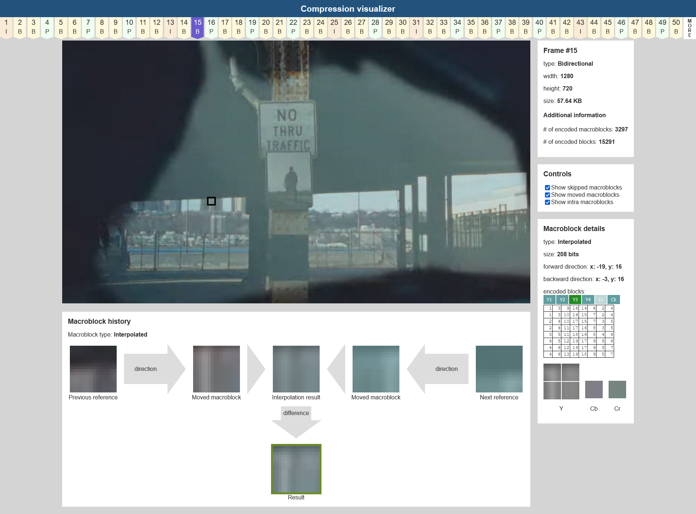
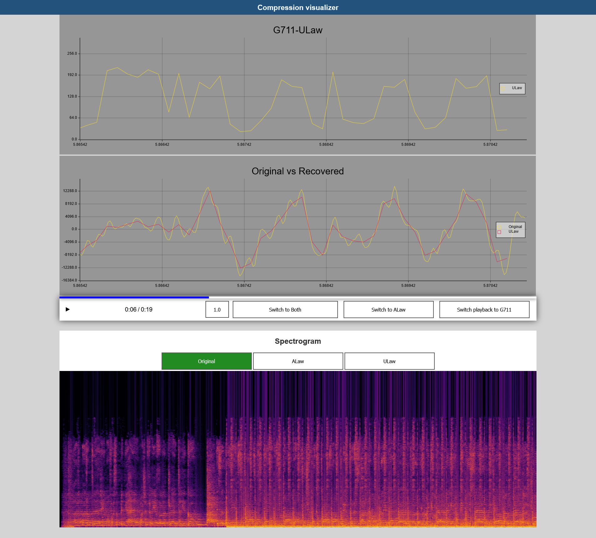

<div align="center">
    <h1>
        jpeg-mpeg-visualizer
	</h1>
    <p>
        WebAssembly application visualizing the JPEG, MPEG-1 and G.711 compression algorithms
    </p>
    <a href="https://jpeg-visualizer.netlify.app"><strong>Open in browser &#187;</strong></a>
</div>

## About the project

This project aims to visualize the principles of image compression (JPEG), video compression (MPEG-1) and audio compression (G.711).
It utilizes WebAssembly and works completely inside the browser.
The whole application was written in Rust.
It was created as our engineer's thesis. 

## Screenshots







## Features

* **JPEG**
  * see how the image is converted into Y'CbCr color space
  * view the effect of chroma subsampling
  * adjust the quality slider to see how different quantization tables behave
  * compare original and recovered image side by side
* **MPEG-1**
  * view the type of each frame
  * inspect the decoded information inside each macroblock
  * view the evolution of a given macroblock
  * adjust which types of macroblocks are being displayed
* **G.711**
  * compare the A-law and μ-law algorithms
  * switch the playback between original and recovered signal
  * create the spectrogram of the signal

The application can analyze user supplied inputs.
The JPEG and G.711 section should work with any file format supported by the used web browser.
The MPEG-1 section can only play MPEG-1 encoded videos inside the MPEG-TS container.
You can use [FFmpeg][ffmpeg] to generate your own samples 
(the resulting video will contain 2 B-frames between non-B-frames, adjust the bitrate by changing the value of `b:v` parameter): 
`ffmpeg -i INPUT -c:v mpeg1video -b:v 2000k -bf 2 -an OUTPUT.ts`

## Getting started

This project is using [wasm-pack][wasm-pack] for building the WebAssembly package and all necessary JavaScript shims.

Run the following command to build the WebAssembly package:
```
wasm-pack build --target web
```

You can then use any web server to host the root folder of this project and navigate to `http://localhost:[PORT]/www` to run the application.

The supplied `Makefile` contains the rules to build the project and to run static analysis tools.

## Team

<table align="center">
<tr>
<th align="center">
    <br> 
    <a href="https://github.com/szebniok">Konrad Bochnia</a>
</th>
<th align="center">
    <br> 
    <a href="https://github.com/XertDev">Michał Jakubek</a>
</th>
<th align="center">
    <br> 
    <a href="https://github.com/mwegrzyn2311">Michał Węgrzyn</a>
</th>
</tr>
</table>

<p align="center">
This project was created as our engineer's thesis.
</p>

## Built with

The MPEG-1 decoder was strongly inspired by the [JSMpeg][jsmpeg] and [PL_MPEG].

Notable crates used by this project:
* [Seed](https://seed-rs.org)
* [gloo](https://gloo-rs.web.app)
* [bitvec](https://crates.io/crates/bitvec)
* [rustfft](https://crates.io/crates/rustfft)
* [plotters](https://crates.io/crates/plotters) and [plotters-canvas](https://crates.io/crates/plotters-canvas)
* [strum](https://crates.io/crates/strum)
* [colorous](https://crates.io/crates/colorous)

## License

Distributed under the MIT License. See `LICENSE` for more information.

## Acknowledgments

* [How JPEG works (Christopher G. Jennings)](https://cgjennings.ca/articles/jpeg-compression/)
* [JPEG - Wikipedia](https://en.wikipedia.org/wiki/JPEG)
* [MPEG Transport Stream - Wikipedia](https://en.wikipedia.org/wiki/MPEG_transport_stream)
* [@phoboslab][phoboslab]'s excellent MIT licensed [JSMpeg][jsmpeg] and [PL_MPEG][pl_mpeg] libraries
* [escrichov/G711](https://github.com/escrichov/G711)

[wasm-pack]: https://rustwasm.github.io/wasm-pack/
[jsmpeg]: https://jsmpeg.com
[pl_mpeg]: https://github.com/phoboslab/pl_mpeg
[ffmpeg]: https://www.ffmpeg.org
[phoboslab]: https://github.com/phoboslab